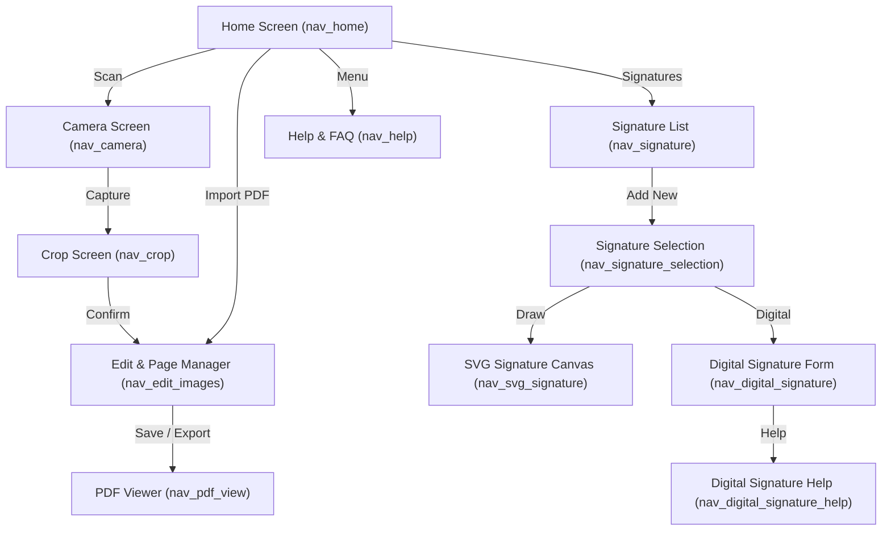

# DocumentsApp 📄✨

An advanced, feature-rich Android document scanning, editing, and digital signing application built with modern Android architecture and Jetpack components.

---

## 🚀 Strong Features & Core Capabilities

### 1. 📷 Smart Document Scanning & Edge Detection
* **Camera Integration:** Seamless document capture using CameraX.
* **OpenCV Edge Detection:** Automatic document bounding box and edge detection for crisp, professional scans.
* **Interactive Cropping:** Precise crop overlay view (`CropFragment`) to adjust scan boundaries.

<!-- TODO: Add screenshot of the Camera & Scan Cropping here -->

---

### 2. 🎛️ Powerful Multi-Page Document Editing
* **Multi-Page Management:** Add, reorder, rotate (90° increments), and delete pages on the fly using `DocumentViewModel`.
* **Image Filters:** Apply grayscale, black & white, and custom color filters.
* **Retake Workflow:** Replace or retake specific scanned pages (`retakePageIndex`) seamlessly.

<!-- TODO: Add screenshot of the Multi-page Edit & Page Manager here -->

---

### 3. ✍️ Advanced Signature & PDF Signing Studio
* **SVG Signature Canvas (`SvgSignatureFragment`):** Draw smooth signatures with multiple tools (Classic Pen, Pencil, Eraser) and export to SVG.
* **Digital Signatures (P12 Keystore):** Generate self-signed cryptographic X.509 digital certificates (`P12Generator`) and sign PDF documents securely (`PdfSigner`).

<!-- TODO: Add screenshot of the Signature Canvas & Digital P12 Signing here -->

---

### 4. 🧪 Automated Testing & CI/CD Pipeline
* **Robust Test Suite:** **23 passing unit and Robolectric UI state/navigation tests** covering ViewModels, crypto generation, SVG/PDF exporters, and navigation transitions.
* **Custom Gradle Task:** Run all tests locally with a single command:
  ```bash
  ./gradlew runAllTests
  ```
* **GitHub Actions CI:** Automated workflow (`.github/workflows/android.yml`) that builds the app and executes all tests on every push and pull request.

---

## 🗺️ App Navigation Flow



---

## 🛠️ Getting Started & Local Testing

Clone the repository and run all tests locally:

```bash
git clone https://github.com/your-username/DocumentsApp.git
cd DocumentsApp
./gradlew runAllTests
```
