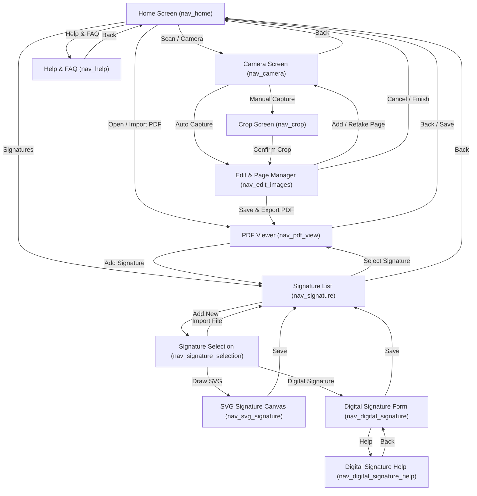

# Documents Scanner 📄✨

An advanced, feature-rich document scanning, editing, and digital signing application built for Android architecture.

> 📚 **Detailed Technical Documentation**: For an in-depth architectural breakdown, computer vision algorithms, cryptographic signing details, and component diagrams, visit the [In-Depth Documentation](docs/DOCUMENTATION.md).

---

## 🚀 Core Capabilities

### 1. 📷 Smart Document Scanning & Edge Detection
* Uses phone **Main Camera** for scanning Paper Documents.
* Supports both **Manual** and **Automatic Cropping**.
* Uniformly fit and scale the document in A4 pages.

<!-- TODO: Add screenshot of the Camera & Scan Cropping here -->

---

### 2. 📄  Powerful Multi-Page Document Editing
* **Multi-Page Management:** Add, reorder, rotate, and delete pages effortlessly.
#### Complete list of Filters:
  - *Black & White*
  - *Blur Remover*
  - *Equalizer*
  - *Greyscale*
  - *Invert*
  - *Sketch*
  - *Brightness*
  - *Contrast*

<!-- TODO: Add screenshot of the Multi-page Edit & Page Manager here -->

---

### 3. ✍️ Signature Support
* Supports both real Digital Signatures and custom Handwritten Signatures for esthetics.
* **Signature Creation:** Draw and save custom handwritten signatures using an interactive SVG signature canvas.
* **Digital Signatures:** Securely sign PDF documents using cryptographic P12 keystores and digital certificates.

<!-- TODO: Add screenshot of the Signature Canvas & Digital P12 Signing here -->

---

### 4. 🧪 Automated Testing & CI/CD Pipeline
* **Test Suite for continuous integration** 
* **Custom Gradle Task:** Run all tests locally with a single command:
  ```bash
  ./gradlew runAllTests
  ```
* **GitHub Actions CI:** Automated workflow (`.github/workflows/android.yml`) that builds the app and executes all tests on every push and pull request.

---

## 🗺️ App Navigation Flow



---

## 🛠️ Getting Started & Local Testing

Clone the repository and run all tests locally:

```bash
git clone https://github.com/your-username/DocumentsApp.git
cd DocumentsApp
./gradlew runAllTests
```

---

## 📚 Technical Documentation

For complete developer guides, technical specifications, computer vision pipeline details, and architecture diagrams, check out the dedicated documentation:

* 📖 **[In-Depth Technical Documentation](docs/DOCUMENTATION.md)**
  * [Architecture & System Overview](docs/DOCUMENTATION.md#-architecture--system-overview)
  * [Component Architecture & UI Layer](docs/DOCUMENTATION.md#-component-architecture--ui-layer)
  * [Smart Document Scanning & Edge Detection](docs/DOCUMENTATION.md#-smart-document-scanning--edge-detection)
  * [Multi-Page Editing & Image Processing Engine](docs/DOCUMENTATION.md#-multi-page-editing--image-processing-engine)
  * [PDF Generation & Interactive Viewing Engine](docs/DOCUMENTATION.md#-pdf-generation--interactive-viewing-engine)
  * [Signature Engine (SVG Vector & Cryptographic P12)](docs/DOCUMENTATION.md#-signature-engine-svg-vector--cryptographic-p12)
  * [Data Persistence & Storage Management](docs/DOCUMENTATION.md#-data-persistence--storage-management)
  * [Testing Strategy & CI/CD Pipeline](docs/DOCUMENTATION.md#-testing-strategy--cicd-pipeline)
  * [Security, Privacy & Scoped Storage](docs/DOCUMENTATION.md#-security-privacy--scoped-storage)

